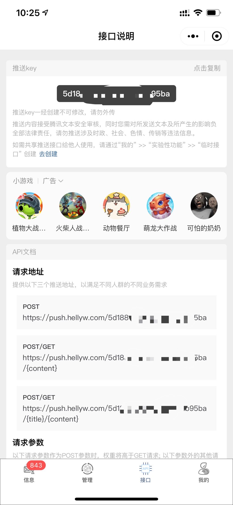
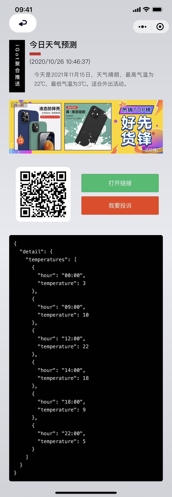

# 请您知悉 :id=quick-start

iGot是一款聚合APP、邮箱、微信等多种方式的第三方推送平台，您可以通过一行代码、一次请求简单实现消息推送。

本文档面向普通用户、开发者分别进行介绍。如有疑惑，可通过文档结尾的[开放讨论](#contactUs)方式进行反馈

# 基础教程

## 微信小程序

### 获取您的推送key

1. 获取微信小程序

微信搜索“iGot” 或扫描下方小程序码<br>


2. 获取您的推送key

进入接口，完成认证。点击上方复制按钮即可获取推送key 



!> 该推送key 为固定key。 认证申请后将无法进行更改。 如需分享，建议使用临时key。 详见[进阶教程 - 临时链接]

### 发送您的第一条消息

> 主机地址：

```
https://push.hellyw.com
```

> 请求path：

```
GET

/:key/:content 
/:key/:title/:content 
```

```
POST

/:key
```

> 请求参数：

```javascript
{
  "title": "请求标题",
  "content": "请求正文",
  // 推送携带的url
  "url": "https://www.baidu.com",
  // 自动复制； 为1自动复制； 默认为1
  "automaticallyCopy": 1,
  // 需要复制的文本内容
  "copy": "复制文本",
  // 目前仅在订阅消息下有效； 订阅者可通过推送主体选择是否接收消息
  "topic": "推送主题",
  // 其余参数， 其他请求参数会作为调试参数以json的形式显示在推送内容中。
  ...
}
```

e.g:

需要每天早上指定时间向我推送一条天气情况的消息，则可以通过下方请求方式实现。

```
POST

https://push.hellyw.com/5e6e29038c2eec6f24b26408

```
```json

{
  "title" : "今日天气预测",
  "content" : "今天是2021年11月15日，天气晴朗，最高气温为22℃，最低气温为3℃。适合外出活动。",
  "url": "http://www.weather.com.cn",
  "detail": {
    "temperatures": [{
        "hour": "00:00",
        "temperature": 3
      },{
        "hour": "09:00",
        "temperature": 10
      },{
        "hour": "12:00",
        "temperature": 22
      },{
        "hour": "14:00",
        "temperature": 18
      },{
        "hour": "18:00",
        "temperature": 9
      },{
        "hour": "22:00",
        "temperature": 5
      }]
  }
}
```

那么您将收到如下的一条推送消息



## Electron-iGot(桌面客户端)

Electron-iGot基于[iGot开放平台 - 客户端接口](#clientOpenApi)，在[Electron-iGot项目](https://github.com/wahao/Electron-iGot)内维护。可通过[国内gitee镜像](https://gitee.com/HellyW/Electron-iGot/releases)快速下载体验。

!> 目前已支持的登录方式为授权码登录。

## utools插件版

> 文档正在整理中
### 安装utools

下载地址 ： https://u.tools/download.html <br>

说明文档 ： https://u.tools/docs/guide/about-uTools.html <br>

### 安装插件

呼出utools （ Option + Space 、 Alt + Space ）进入插件中心搜索”iGot“安装 <br>

### 绑定iGot

调出utools， 输入 bind:igot:XXX  回车

!> 其中XXX为您获取的24位有效的推送key ； 使用该命令也可更新iGot推送key

### 发送消息

您可通过utools输入框完成发送，也可通过复制文本调起超级面板快捷发送


## IOS快捷指令

您需要先安装apple官方的快捷指令app

### 安装快捷指令

浏览器输入 `https://jiejinghe.com/shortcuts/9371959496` 按指引完成操作

### 发送消息

点开该快捷指令或是选择文字 > 共享 > iGot推送

!> 关于iGot更多玩法可参考下方[外部链接](#shareHelpDocs)

# 进阶教程

> 文档正在整理中


# 开放平台

> 文档正在整理中

## 第三方授权使用

该部分可帮助第三方开发者（微信小程序、公众号、H5）快速接入iGot，获取通知权限，获取权限的应用可通过iGot平台向用户推送消息。目前只开放了微信小程序授权。

!> 接入仅前端引导方式不同，服务端接口通用。

目前可通过微信小程序“Hacker密码”体验完整的授权逻辑。


### 微信小程序

1. 授权允许跳转
```json
    "navigateToMiniProgramAppIdList":["wx74db71d8a9e3b699"]
```
2. 跳转
```javascript
  wx.navigateToMiniProgram({
    appId: 'wx74db71d8a9e3b699',
    path: '/pages/bind/app',
    extraData: {
      appName: '',    // 必填，修改为您当前小程序名称
      openid: ''    // 必填，修改为当前用户的openid
    },
    envVersion: 'release',
    success(res) {
      // 打开成功
    }
  })
  // openid 请填写真实有效的openid
  // 授权成功后， 该用户与之绑定的openid不可修改
  // 虚假的openid将导致信息发送错乱
```
3. 接收授权结果

> 用户授权成功或失败后，Bark助手都将返回源小程序 <br />
> 您需要在`App.onLaunch`或`App.onShow`监听来自`appId: 'wx74db71d8a9e3b699'`的`extraData`数据<br >
> 建议在`App.onShow`内监听<br />

数据格式为：

```json
  "extraData":{
    "key":"",   //app的授权key （ 用户key ），可忽略
    "bind":true,   //绑定状态 Boolean
    "errMsg":""   //错误信息 bind为false是会返回
  }
```

示例代码：

```javascript
  onShow(event){
    if(event && event.referrerInfo && event.referrerInfo.appId === 'wx74db71d8a9e3b699'){
      const _extraData = ( event && event.referrerInfo && event.referrerInfo.extraData ) || {}
      if(_extraData.bind){
        //绑定成功
        console.log(_extraData.key)
      }else{
        //绑定失败
        console.log(_extraData.errMsg)
      }
    }
  }
```

至此，小程序前端绑定成功。 服务端可通过 `appid` 和 `openid` 向该用户发送推送消息


### 服务端调用


#### 准备开始

> host: `https://push.hellyw.com/access/`

> appId: 微信分配的appid

#### 获取 appSerect

!> 初次请求，appSerect可传空。 之后请求需传原appSerect

```
  GET
  /security/getappserect/?appid=APPID&appserect=APPSERECT

```

```json
{
  "ret": 0, // 0 为正确响应
  "data":{
      "appSerect":"rWsdahw4aj-04hbxjsa-1jbsaj"
    },
  "errMsg":"success"
}
```

#### 获取 ACCESS_TOKEN

```
  GET
  /security/getaccesstoken/?appid=APPID&appserect=APPSERECT

```

```json
{
  "ret": 0, // 0 为正确响应
  "data":{
      "access_token": "sdahw4aj-04hbxjsa-1jb",
      "expire": 7200
    },
  "errMsg":"success"
}
```

!> access_token有效期为7200秒，频繁刷新会被拒绝哦，记得缓存并刷新哦~~ 


#### 推送消息

##### 指定对象推送

* 推送

```
  POST
  /message/?openid=OPENID&access_token=ACCESS_TOKEN

```

```json
{
  "title" : "推送标题", // 必填
  "content" : "推送的内容", // 必填
  "automaticallyCopy" : 1,// 可选
  "copyText" : "自定义拷贝文本",// 可选
  "url" : "详情链接"// 可选
}

```

```json
{
  "ret": 0, // 0 为正确响应
  "data":{
      "id": "5d19a088a5a60b536f514c69" // 发送成功 message id
    },
  "errMsg":"success"
}
```

* 查询结果

```
  GET
  /message/{id}?access_token=ACCESS_TOKEN
```

```json
{
  "ret": 0, // 0 为正确响应
  "data":{
      "push": true, // 推送状态
      "read": false, // 是否已读
    },
  "errMsg":"success"
}
```

##### 群发信息

> `开放使用  测试观察中`

* 群发所有订阅者

```
  POST
  /fsend/?access_token=ACCESS_TOKEN

```

```json
{
  "title" : "推送标题", // 必填
  "content" : "推送的内容", // 必填
  "automaticallyCopy" : 1,// 可选
  "copyText" : "自定义拷贝文本",// 可选
  "url" : "详情链接"// 可选
}

```

```json
{
  "ret": 0, // 0 为正确响应
  "data":{
      "id": "5d19a088a5a60b536f514c69" // 发送成功 fsend id
    },
  "errMsg":"success"
}
```


* 查询结果

```
  GET
  /fsend/{id}?access_token=ACCESS_TOKEN
```

```json
{
  "ret": 0,
  "data": {
    "body": {
      "title" : "推送标题", // 必填
      "content" : "推送的内容", // 必填
      "automaticallyCopy" : 1,// 可选
      "copyText" : "自定义拷贝文本",// 可选
      "url" : "详情链接"// 可选
    },
    "checked": 2, //  是否通过文本安全检查   0 - 待检查  1 - 未通过  2 - 已通过
    "status": 2,  //  执行队列状态  0 - 排队中  1 - 处理中  2 - 处理成功
    "success": 1,  //  成功发送用户人数
    "error": 0  //  失败发送用户人数
  },
  "errMsg": "success"
}
```


#### 获取IP白名单

```
  GET
  /security/ip/?access_token=ACCESS_TOKEN

```

```json
{
  "ret": 0, // 0 为正确响应
  "data":{
      "ipList": ["101.200.3.100","121.9.29.19"]
    },
  "errMsg":"success"
}
```

#### 设置IP白名单

!> 除初次请求外，请通过已指定白名单ip请求该接口

```
  POST
  /security/ip/?access_token=ACCESS_TOKEN

```


```json
{
  "ipList": ["101.200.3.100","121.9.29.19"]
}
```

!> 为防止误操作，初次请求会将请求ip加入白名单

```json
{
  "ret": 0, // 0 为正确响应
  "data":{},
  "errMsg":"success"
}
```


## 客户端接口 :id=clientOpenApi

> 不同于上面的文档，此部分文档并非为授权使用，而是满足第三方开发者用于开发多场景应用的需求。<br />

> 为扩展应用使用场景，开放一部分第三方接口。方便更多开发者通过接口适配更多应用。iGot客户端即通过此部分接口实现<br />

> 开发者通过这部分接口可以轻松实现对个人账户的管理<br />

### 准备工作

* 现阶段请求接口不做鉴权，但请做好鉴权适配规划 

> host: `https://push.hellyw.com/open/` <br />

#### 请求响应状态字

> 部分请求状态字，请做好适配。以下状态字都在网络请求状态200下返回

##### 0

* 0 为正确请求响应

##### 1XX

> 程序错误，收到1XX类错误建议提醒用户刷新或再次触发 ， 以下不做赘述<br />


* 101 登录状态传递错误

##### 2XX

> 通用错误， 收到2XX类错误。可直接报出此错误。或只做日志记录 <br />

* 201 程序捕获错误以此返回 

##### 3XX

> 用户侧身份有问题 , 收到3XX类错误。请跳转至登录验证页。要求重新登录 <br />

* 300 token为空
* 301 token错误
* 302 token过期
* 303 登录失败，验证码无效
* 304 登录失败，验证码为空


##### 4XX

##### 5XX


### 接入

#### 登录

> 登录设计了两种方式 `随机验证码`登录 和 `手机号`登录 ， 目前只支持随机验证码登录 

##### 随机验证码登录

> 您需要引导用户获取随机验证码。 获取方式为 <br />

* 1. 扫描下方固定小程序码


* 2. 打开小程序，依次选择“我的” >> “实验性功能” >> “他端登录”

```
  POST
  /user/login

```

请求示例：<br />

```json
{
  "code": "3uf76"
}
```

!> code有效期为5分钟，且刷新后失效。请提醒用户尽快完成登录动作

响应示例：<br />

```json
{
  "ret": 0, // 0 为正确响应; 请求响应状态字
  "data":{
      "token": "4575e25013ea11ea9d4825a7238640a7"
    },
  "errMsg":"success"  // 错误详情
}
```
!> 之后所有请求都需要携带token值

!> 一般情况下， token的有效期为8小时。如用户更换code，token也将提前失效。请务必做好token失效后的重新登录

#### 获取历史推送消息


```
  GET
  /message/?token=token&index=1&size=20

```

!> size建议使用20-30；请勿超过50

```json
{
  "ret": 0,  // 0 为正确响应; 请求响应状态字
  "data": { 
    "messages": [{
      "id": "5de0db16aec09e401a13e3b1", // message id
      "body": {  //body 消息主体
        "automaticallyCopy": 1,  // 自动复制
        "copyText": "",  // 自动复制文本
        "title": "感谢您的试用",  //  标题
        "content": "iGot是一款集公众号、邮箱、APP提醒等多种形式的聚合推送工具，一行代码接入系统，轻松实现状态监听、信息接收。支持订阅推送、api推送、手动推送；发挥您的创造力，用它来及时掌握更多信息。点击链接获取使用教程，桌面客户端下载及更多交流可加入QQ群 「 909540238 」",    //  正文
        "url": "https://wahao.github.io/Bark-MP-helper/#/zh-cn/"  //  超链接 url
      },
      "mode": "小程序",  //  推送通过何种方式送达
      "read": true,   //  是否已读
      "app": "iGot聚合推送",  //  推送方主体  应用名 
      "createTime": "2019-11-29T08:44:43.430Z"  // 推送时间
    }],
    "count": 1   //  消息条数
  },
  "errMsg": "success"  // 错误详情
}
```


#### 获取推送消息详情

!> 推送消息详情已在列表接口展示，此接口为方便开发者实现业务场景设计。同时该接口兼具已读标记功能


```
  GET
  /message/:id?token=token

```

```json
{
  "ret": 0,  // 0 为正确响应; 请求响应状态字
  "data": { 
    "message": {
      "id": "5de0db16aec09e401a13e3b1", // message id
      "body": {  //body 消息主体
        "automaticallyCopy": 1,  // 自动复制
        "copyText": "",  // 自动复制文本
        "title": "感谢您的试用",  //  标题
        "content": "iGot是一款集公众号、邮箱、APP提醒等多种形式的聚合推送工具，一行代码接入系统，轻松实现状态监听、信息接收。支持订阅推送、api推送、手动推送；发挥您的创造力，用它来及时掌握更多信息。点击链接获取使用教程，桌面客户端下载及更多交流可加入QQ群 「 909540238 」",    //  正文
        "url": "https://wahao.github.io/Bark-MP-helper/#/zh-cn/"  //  超链接 url
      },
      "mode": "小程序",  //  推送通过何种方式送达
      "read": true,   //  是否已读
      "app": "iGot聚合推送",  //  推送方主体  应用名 
      "createTime": "2019-11-29T08:44:43.430Z"  // 推送时间
    }
  },
  "errMsg": "success"  // 错误详情
}
```


#### 标记消息为已读


```
  POST
  /message/:id?token=token

```

```json
{
  "ret": 0,  // 0 为正确响应; 请求响应状态字
  "data": {
  },
  "errMsg": "success"  // 错误详情
}
```


#### 获取已授权的第三方应用


```
  GET
  /relate/?token=token&index=1&size=20

```

```json
{
  "ret": 0,    // 0 为正确响应; 请求响应状态字
  "data": {
    "relates": [{
      "id": "5de0da7aaec09e401a13e384",    //  授权关系  id
      "allow": true,   //  是否启用强推送
      "app": "iGot聚合推送"  // 应用名
    }],
    "count": 1
  },
  "errMsg": "success" // 错误详情
}
```

#### 切换已授权第三方应用强提醒状态


```
  POST
  /relate/:id?token=token

```

!> 您不必传入打开或关闭的状态，服务端会根据当前状态做自动切换

```json
{
  "ret": 0,    // 0 为正确响应; 请求响应状态字
  "data": {},
  "errMsg": "success" // 错误详情
}
```


#### 群发链接服务创建


```
  POST
  /link/group

```

```json
{
  "name": "北京明日雾霾状况提醒",  // 服务名 ， 必填
  "open": true  //  是否开放关注 ， 选填   默认 false
}
```

```json
{
  "ret": 0,  // 0 为正确响应; 请求响应状态字
  "data": {
    "key": "5df30a5c55df6a63fa4273e7"   //  推送key
  },
  "errMsg": "success"  // 错误详情
}
```


#### 获取已创建的群发链接服务


```
  GET
  /link/group?token=token&index=1&size=20

```

```json
{
  "ret": 0,   // 0 为正确响应; 请求响应状态字
  "data": {
    "links": [{
      "key": "5df30a5055df6a63fa4273e5",   //  推送 key
      "name": "「 测试 」服务",   //  服务名
      "subscribe": "https://push.hellyw.com/static/link/GL_952264701d5b11eab4c3e551cb1ff61b.png"   // 关注二维码
    }],
    "count": 1
  },
  "errMsg": "success"  // 错误详情
}
```


#### 获取所有开放的群推链接


```
  GET
  /link/group/market?token=token&index=1&size=20

```

```json
{
  "ret": 0,   // 0 为正确响应; 请求响应状态字
  "data": {
    "links": [{
      "name": "「 测试 」服务",   //  服务名
      "subscribe": "https://push.hellyw.com/static/link/GL_952264701d5b11eab4c3e551cb1ff61b.png"   // 关注二维码
    }],
    "count": 1
  },
  "errMsg": "success"  // 错误详情
}
```


#### 获取推送方式及推送顺序


```
  GET
  /push-way/?token=token

```

```json
{
  "ret": 0,  // 0 为正确响应; 请求响应状态字
  "data": {
    "pushWay": {
      "bark": {    //  bark 推送详情
        "key": "F8Q****vue",  //  bark key
        "status": 2  //  绑定状态    0 - 未绑定  1 - 已绑定未验证   2 - 已绑定已验证
      },
      "email": {  //  邮件推送详情
        "key": "he****@hellyw.com",  //  邮件地址
        "status": 2  //  绑定状态    0 - 未绑定  1 - 已绑定未验证   2 - 已绑定已验证
      },
      "wechat": {  //  微信公众号推送方式
        "key": "",    //  微信设备号
        "status": 0  //  绑定状态    0 - 未绑定  1 - 已绑定未验证   2 - 已绑定已验证
      },
      "orders": ["bark", "email", "wechat"]   //  对应上方推送方式  依次为按照 bark 、 邮箱、 微信公众号  逐一尝试推送
    }
  },
  "errMsg": "success"   // 错误详情
}
```

#### 修改推送顺序


```
  POST
  /push-way/orders?token=token

```

```json
{
  "orders": ["email", "bark", "wechat"] // 新的推送顺序
}
```


```json
{
  "ret": 0,  // 0 为正确响应; 请求响应状态字
  "data": {
  },
  "errMsg": "success"   // 错误详情
}
```

#### 绑定新的推送方式

> 仅允许 对应status 为 0 状态下发起   为 1、2 的时候请先引导用户完成解绑

```
  POST
  /push-way/bark/bind?token=token
  /push-way/email/bind?token=token
```
> 微信绑定方式请使用专用接口实现

```json
{
  "key": "wjdnjh2qwe23"  // 地址详情  bark为key  email 为邮箱地址
}
```

```json
{
  "ret": 0,  // 0 为正确响应; 请求响应状态字
  "data": {
  },
  "errMsg": "success"   // 错误详情
}
```

#### 绑定微信公众号推送

> 仅允许 对应status 为 0 状态下发起   为 1、2 的时候请先引导用户完成解绑

```
  GET
  /push-way/wechat/bind?token=token
```


```json
{
  "ret": 0,  // 0 为正确响应; 请求响应状态字
  "data": {
  },
  "errMsg": "success"   // 错误详情
}
```


#### 解除绑定推送方式

> 仅允许 对应status 为 1 、 2 状态下发起   为 0 的时候请先引导用户完成绑定

```
  POST
  /push-way/bark/unbind?token=token
  /push-way/email/unbind?token=token
  /push-way/wechat/unbind?token=token
```

```json
{
  "ret": 0,  // 0 为正确响应; 请求响应状态字
  "data": {
  },
  "errMsg": "success"   // 错误详情
}
```


#### 重新验证推送方式

> 仅允许 对应status 为 1 状态下发起   为 0 的时候请先引导用户完成绑定

```
  POST
  /push-way/bark/verify?token=token
  /push-way/email/verify?token=token
```
> 微信无需单独处理验证


```json
{
  "ret": 0,  // 0 为正确响应; 请求响应状态字
  "data": {
  },
  "errMsg": "success"   // 错误详情
}
```

# 外部链接 :id=shareHelpDocs

* [另辟蹊径：离开模板消息，如何更优雅的向用户推送消息](https://developers.weixin.qq.com/community/develop/article/doc/000c06a47243a80aa7c8541e95b413)

* [「小众工具」打通的不止是手机和电脑的任督二脉](https://mp.weixin.qq.com/s?__biz=MzAwMjg3ODU0NA==&mid=2247483749&idx=1&sn=aed399bb2ac2db084b053b4dbfb49e4a&chksm=9ac2fc5aadb5754c6e7a98da0b29d01dc10bb16e186d7d635e174502046adc5fb1d365657d30&mpshare=1&scene=23&srcid=1023zNEjBacq16jFX2Siz9p0&sharer_sharetime=1603432811199&sharer_shareid=9893d5f0ec65c0f471abe86f0743e12b%23rd)

# 开放讨论 :id=contactUs

[GITHUB](https://github.com/wahao/Bark-MP-helper)

[社区](https://support.qq.com/products/111465)

QQ群： 909540238
