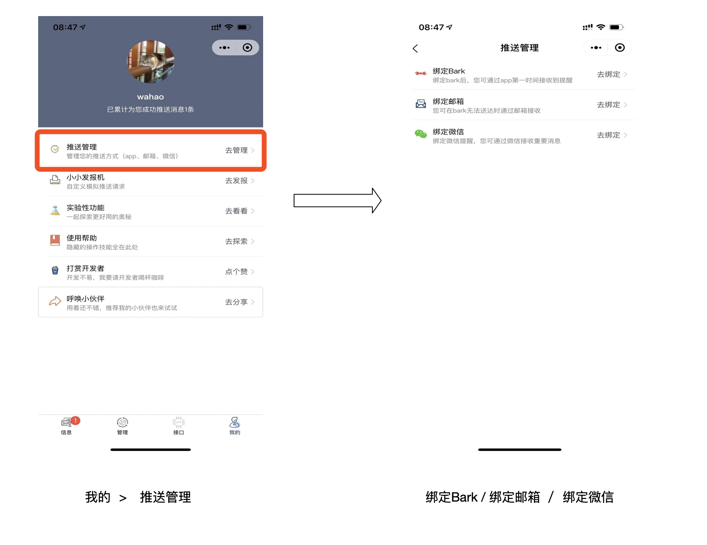
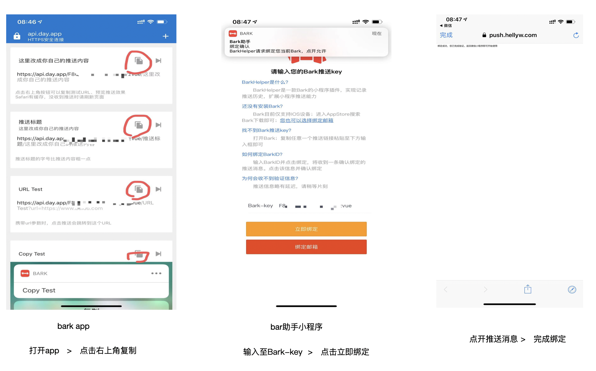
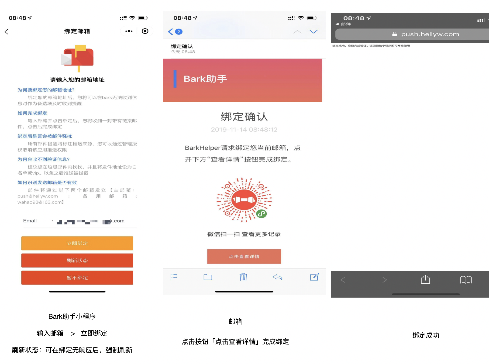

# 快速开始 :id=quick-start

该小程序将APP、邮箱、微信推送进行聚合，一行代码轻松实现推送。同时支持查看历史推送记录、订阅第三方推送、生成临时推送链接等能力<br>

> 该部分文档面向普通使用者

## 名词

### 推送链接

推送链接是方便用户快速实现推送的接口地址。为适应各类场景，主要有`固定链接`、`临时链接`、`订阅链接`。

* 固定链接： 根据用户微信标识生成唯一不变的链接；不建议分享。

> 获取方法： 打开小程序  进入 “接口”

* 临时链接（内测中）： 可自定义接收状态、有效期的临时性的推送地址。可分享，不建议分享给多人

> 获取方法： 打开小程序  依次进入 “实验性功能” >> “临时链接”

* 订阅链接（开发中）： 允许他人订阅。推送后多人可收到消息，可通过授权管理选择是否接收。 建议以项目、工程、分类创建使用。

### 登录验证随机码

允许第三方应用登录并授权获取您的基本信息、推送历史等数据信息。每次登录随机生成，刷新后失效。


### 推送提醒方式
 目前两种推送提醒方式 `强推送` (app、邮箱、微信、短信) 和 `弱提醒`

#### 强提醒

  您将通过绑定的推送方式，接收提醒。如果需要切换弱提醒。请在管理内关闭即可

#### 弱提醒

  您将只会在小程序内收到信息，不会有任何提醒


## 安装
微信搜索“Bark助手” 或扫描下方小程序码<br>
  

## 绑定社交账号

### 如何绑定

> 依次进入 我的 > 推送管理 > 绑定Bark / 绑定邮箱 / 绑定微信 <br >

 

### 绑定Bark
> 暂不支持自建服务器

1. 打开Bark，复制bark内任一推送链接
2. 进入小程序Bark绑定页，输入推送链接（软件会自动识别并粘贴）
3. 点击绑定，收到绑定确认推送
4. 点开推送信息，完成绑定

 


### 绑定邮箱
> 建议将邮箱`push@hellyw.com`、`wahao93@163.com` 添加至白名单或VIP名单，以免无法收到邮件信息

!> 绑定邮箱成功后会出现页面频闪现象，请直接退出并删除小程序后重新进入即可。该问题已在1.0.7.3版本修复。

1. 打开Bark，进入小程序邮箱绑定页，输入邮箱地址（软件会自动识别并粘贴）
2. 点击绑定，收到绑定确认邮件 （未添加白名单，可能在垃圾邮件内）
3. 点开邮件`详情`，完成绑定


 


### 授权微信
> 默认授权为`关闭`
> 该模式下部分推送可能会丢失或无法送达

1. 打开Bark，进入微信授权页
2. 打开授权或取消授权

## 使用
> 允许用户通过简单的api接口进行推送，接口基本继承Bark内接口。对多种推送模式做了一些扩展 <br >
> 小程序内提供一些常见操作的示例及说明

### 接口
> 支持GET、POST请求

```
/:key
/:key/:content 
/:key/:title/:content 
```

!> 此处的key及host 并非bark内提供的key值

### 参数

> POST参数

* title：标题  会显示在正文上方 <br >
* content： 正文 <br >

!> 以上参数优先级高，作为post请求会覆盖url内参数。 以下参数也可作为post内参数调用。

> 基础参数

* url：点击跳转链接 `Bark推送可直接点击；邮件推送将以详情按钮展示；微信则不展示` <br >
* automaticallyCopy：自动复制 `automaticallyCopy=1` <br >
* copy： 复制文本 <br >

> 扩展参数

wechat： 指定微信发送 `wechat=1` <br >


## 说明

### 推送次序

> Q1: 支持哪些途径推送消息

* 用户通过小程序内分配的API发送，支持`Bark`、`邮件`、`微信` 三种方式

!> 推送方式必须被绑定或授权

* 第三方授权应用仅支持`Bark`、`邮件`两种方式 不支持微信推送

> Q2: 推送方式可以被指定么

* 仅微信推送可以通过参数指定，且第三方授权应用不被允许

> Q3: 推送有顺序么？可以指定么

* 推送顺序为尝试`Bark`，无效转`邮件`。其中微信不参与推送顺序尝试

* 暂时不可以指定，系统默认

### 授权相关

> Q1: 不想被打扰，如何关闭通知

* 您可以选择对指定授权应用`关闭提醒`或`取消授权` 

!> Bark助手API推送将通过Bark助手发出。 关闭Bark助手提醒，将无法收到通过上面API推送的信息

> Q2: 关闭提醒和取消授权有什么区别

* 关闭提醒：将不通过Bark或邮件推送，但仍会记录在Bark助手历史记录内。随时可以查看

* 取消授权：授权应用将无法向您推送信息


# iGot 客户端 :id=iGot-client

> iGot客户端通过下方开放接口实现

## 下载

### Mac 客户端

[ 内测中 ， 即将与大家见面 ]

参与内测请扫码加入QQ群


### windows 客户端

[ 规划中 ]


# utools插件

为方便电脑客户端向手机推送消息，我们开发了utools平台的bark助手插件版。您可以通过以下方式体验。

## 下载安装utools

下载地址 ： https://u.tools/download.html <br>

说明文档 ： https://u.tools/docs/guide/about-uTools.html <br>

> 支持 MACOS、WINDOWS、LINUX 平台 <br>

## 安装Bark助手插件 

 呼出utools （ Option + Space 、 Alt + Space ）在插件中心选择 <br>

## 使用 

呼出utools （ Option + Space 、 Alt + Space ） 输入 `push`、`bark`、`推送` 快速进入 <br>

# 开发者接入
> 该部分文档可帮助开发者快速接入Bark助手推送平台

## 微信小程序

1. 授权允许跳转
```json
    "navigateToMiniProgramAppIdList":["wx74db71d8a9e3b699"]
```
2. 跳转
```javascript
  wx.navigateToMiniProgram({
    appId: 'wx74db71d8a9e3b699',
    path: '/pages/bind/app',
    extraData: {
      appName: 'Bark Helper',    // 必填，修改为您当前小程序名称
      openid: ''    // 必填，修改为当前用户的openid
    },
    envVersion: 'release',
    success(res) {
      // 打开成功
    }
  })
  // openid 请填写真实有效的openid
  // 授权成功后， 该用户与之绑定的openid不可修改
  // 虚假的openid将导致信息发送错乱
```
3. 接收授权结果

> 用户授权成功或失败后，Bark助手都将返回源小程序 <br />
> 您需要在`App.onLaunch`或`App.onShow`监听来自`appId: 'wx74db71d8a9e3b699'`的`extraData`数据<br >
> 建议在`App.onShow`内监听<br />

数据格式为：

```json
  "extraData":{
    "key":"",   //app的授权key （ 用户key ），可忽略
    "bind":true,   //绑定状态 Boolean
    "errMsg":""   //错误信息 bind为false是会返回
  }
```

示例代码：

```javascript
  onShow(event){
    if(event && event.referrerInfo && event.referrerInfo.appId === 'wx74db71d8a9e3b699'){
      const _extraData = ( event && event.referrerInfo && event.referrerInfo.extraData ) || {}
      if(_extraData.bind){
        //绑定成功
        console.log(_extraData.key)
      }else{
        //绑定失败
        console.log(_extraData.errMsg)
      }
    }
  }
```

至此，小程序前端绑定成功。 服务端可通过 `appid` 和 `openid` 向该用户发送推送消息

## 服务端

### 准备开始

> host: `https://push.hellyw.com/access/`

> appId: 微信分配的appid

### 获取 appSerect

!> 初次请求，appSerect可传空。 之后请求需传原appSerect

```
  GET
  /security/getappserect/?appid=APPID&appserect=APPSERECT

```

```json
{
  "ret": 0, // 0 为正确响应
  "data":{
      "appSerect":"rWsdahw4aj-04hbxjsa-1jbsaj"
    },
  "errMsg":"success"
}
```

### 获取 ACCESS_TOKEN

```
  GET
  /security/getaccesstoken/?appid=APPID&appserect=APPSERECT

```

```json
{
  "ret": 0, // 0 为正确响应
  "data":{
      "access_token": "sdahw4aj-04hbxjsa-1jb",
      "expire": 7200
    },
  "errMsg":"success"
}
```

!> access_token有效期为7200秒，频繁刷新会被拒绝哦，记得缓存并刷新哦~~ 


### 推送消息

#### 指定对象推送

* 推送

```
  POST
  /message/?openid=OPENID&access_token=ACCESS_TOKEN

```

```json
{
  "title" : "推送标题", // 必填
  "content" : "推送的内容", // 必填
  "automaticallyCopy" : 1,// 可选
  "copyText" : "自定义拷贝文本",// 可选
  "url" : "详情链接"// 可选
}

```

```json
{
  "ret": 0, // 0 为正确响应
  "data":{
      "id": "5d19a088a5a60b536f514c69" // 发送成功 message id
    },
  "errMsg":"success"
}
```

* 查询结果

```
  GET
  /message/{id}?access_token=ACCESS_TOKEN
```

```json
{
  "ret": 0, // 0 为正确响应
  "data":{
      "push": true, // 推送状态
      "read": false, // 是否已读
    },
  "errMsg":"success"
}
```

#### 群发信息

> `开放使用  测试观察中`

* 群发所有订阅者

```
  POST
  /fsend/?openid=OPENID&access_token=ACCESS_TOKEN

```

```json
{
  "title" : "推送标题", // 必填
  "content" : "推送的内容", // 必填
  "automaticallyCopy" : 1,// 可选
  "copyText" : "自定义拷贝文本",// 可选
  "url" : "详情链接"// 可选
}

```

```json
{
  "ret": 0, // 0 为正确响应
  "data":{
      "id": "5d19a088a5a60b536f514c69" // 发送成功 fsend id
    },
  "errMsg":"success"
}
```


* 查询结果

```
  GET
  /fsend/{id}?access_token=ACCESS_TOKEN
```

```json
{
  "ret": 0,
  "data": {
    "body": {
      "title" : "推送标题", // 必填
      "content" : "推送的内容", // 必填
      "automaticallyCopy" : 1,// 可选
      "copyText" : "自定义拷贝文本",// 可选
      "url" : "详情链接"// 可选
    },
    "checked": 2, //  是否通过文本安全检查   0 - 待检查  1 - 未通过  2 - 已通过
    "status": 2,  //  执行队列状态  0 - 排队中  1 - 处理中  2 - 处理成功
    "success": 1,  //  成功发送用户人数
    "error": 0  //  失败发送用户人数
  },
  "errMsg": "success"
}
```


### 获取IP白名单

```
  GET
  /security/ip/?access_token=ACCESS_TOKEN

```

```json
{
  "ret": 0, // 0 为正确响应
  "data":{
      "ipList": ["101.200.3.100","121.9.29.19"]
    },
  "errMsg":"success"
}
```

### 设置IP白名单

!> 除初次请求外，请通过已指定白名单ip请求该接口

```
  POST
  /security/ip/?access_token=ACCESS_TOKEN

```


```json
{
  "ipList": ["101.200.3.100","121.9.29.19"]
}
```

!> 为防止误操作，初次请求会将请求ip加入白名单

```json
{
  "ret": 0, // 0 为正确响应
  "data":{},
  "errMsg":"success"
}
```

# 开放接口

## 第三方客户端

> 不同于上面的文档，此部分文档并非为授权使用

> 为扩展应用使用场景，开放一部分第三方接口。方便更多开发者通过接口适配更多应用。iGot客户端即通过此部分接口实现<br />

### 准备工作

* 现阶段请求接口不做鉴权，但请做好鉴权适配规划 

> host: `https://push.hellyw.com/open/` <br />

#### 请求响应状态字

> 部分请求状态字，请做好适配。以下状态字都在网络请求状态200下返回

##### 0

* 0 为正确请求响应

##### 1XX

> 程序错误，收到1XX类错误建议提醒用户刷新或再次触发 ， 以下不做赘述<br />


* 101 登录状态传递错误

##### 2XX

> 通用错误， 收到2XX类错误。可直接报出此错误。或只做日志记录 <br />

* 201 程序捕获错误以此返回 

##### 3XX

> 用户侧身份有问题 , 收到3XX类错误。请跳转至登录验证页。要求重新登录 <br />

* 300 token为空
* 301 token错误
* 302 token过期
* 303 登录失败，验证码无效
* 304 登录失败，验证码为空


##### 4XX

##### 5XX


### 接入

#### 登录

> 登录设计了两种方式 `随机验证码`登录 和 `手机号`登录 ， 目前只支持随机验证码登录 

##### 随机验证码登录

> 您需要引导用户获取随机验证码。 获取方式为 <br />

* 1. 扫描下方固定小程序码

* 2. 打开小程序，依次选择“我的” >> “实验性功能” >> “他端登录”

```
  POST
  /user/login

```

请求示例：<br />

```json
{
  "code": "3uf76"
}
```

!> code有效期为5分钟，且刷新后失效。请提醒用户尽快完成登录动作

响应示例：<br />

```json
{
  "ret": 0, // 0 为正确响应; 请求响应状态字
  "data":{
      "token": "4575e25013ea11ea9d4825a7238640a7"
    },
  "errMsg":"success"  // 错误详情
}
```
!> 之后所有请求都需要携带token值

!> 一般情况下， token的有效期为8小时。如用户更换code，token也将提前失效。请务必做好token失效后的重新登录

#### 获取历史推送消息


```
  GET
  /message/?token=token&index=1&size=20

```

!> size建议使用20-30；请勿超过50

```json
{
  "ret": 0,  // 0 为正确响应; 请求响应状态字
  "data": { 
    "messages": [{
      "id": "5de0db16aec09e401a13e3b1", // message id
      "body": {  //body 消息主体
        "automaticallyCopy": 1,  // 自动复制
        "copyText": "",  // 自动复制文本
        "title": "感谢您的试用",  //  标题
        "content": "Bark助手是一款集app、邮箱、微信等多种途径的推送工具。支持订阅推送、api推送、手动推送；发挥您的创造力，用它来及时掌握更多信息。点击链接获取使用教程",    //  正文
        "url": "https://wahao.github.io/Bark-MP-helper/#/zh-cn/"  //  超链接 url
      },
      "mode": "小程序",  //  推送通过何种方式送达
      "read": true,   //  是否已读
      "app": "Bark助手",  //  推送方主体  应用名 
      "createTime": "2019-11-29T08:44:43.430Z"  // 推送时间
    }],
    "count": 1   //  消息条数
  },
  "errMsg": "success"  // 错误详情
}
```


#### 获取推送消息详情

!> 推送消息详情已在列表接口展示，此接口为方便开发者实现业务场景设计。同时该接口兼具已读标记功能


```
  GET
  /message/:id?token=token

```

```json
{
  "ret": 0,  // 0 为正确响应; 请求响应状态字
  "data": { 
    "message": {
      "id": "5de0db16aec09e401a13e3b1", // message id
      "body": {  //body 消息主体
        "automaticallyCopy": 1,  // 自动复制
        "copyText": "",  // 自动复制文本
        "title": "感谢您的试用",  //  标题
        "content": "Bark助手是一款集app、邮箱、微信等多种途径的推送工具。支持订阅推送、api推送、手动推送；发挥您的创造力，用它来及时掌握更多信息。点击链接获取使用教程",    //  正文
        "url": "https://wahao.github.io/Bark-MP-helper/#/zh-cn/"  //  超链接 url
      },
      "mode": "小程序",  //  推送通过何种方式送达
      "read": true,   //  是否已读
      "app": "Bark助手",  //  推送方主体  应用名 
      "createTime": "2019-11-29T08:44:43.430Z"  // 推送时间
    }
  },
  "errMsg": "success"  // 错误详情
}
```


#### 标记消息为已读


```
  POST
  /message/:id?token=token

```

```json
{
  "ret": 0,  // 0 为正确响应; 请求响应状态字
  "data": {
  },
  "errMsg": "success"  // 错误详情
}
```


#### 获取已授权的第三方应用


```
  GET
  /relate/?token=token&index=1&size=20

```

```json
{
  "ret": 0,    // 0 为正确响应; 请求响应状态字
  "data": {
    "relates": [{
      "id": "5de0da7aaec09e401a13e384",    //  授权关系  id
      "allow": true,   //  是否启用强推送
      "app": "Bark助手"  // 应用名
    }],
    "count": 1
  },
  "errMsg": "success" // 错误详情
}
```

#### 切换已授权第三方应用强提醒状态


```
  POST
  /relate/:id?token=token

```

!> 您不必传入打开或关闭的状态，服务端会根据当前状态做自动切换

```json
{
  "ret": 0,    // 0 为正确响应; 请求响应状态字
  "data": {},
  "errMsg": "success" // 错误详情
}
```


# 版本构想

> 版本设计，当前最新版本详见升级日志内最新版本。构想的大版本将通过小版本迭代实现。<br />

> utools等平台插件版本升级日志及升级计划也将在此同步，版本号将共享。

## v1.1.0

### 小程序

* ~~ 支持消息分页查询，可浏览所有消息 （v1.0.2 实现）~~
* 支持消息分类，检索查询功能 [排期]
* ~~ 增加多种推送方式（v1.0.3 、v1.0.4 实现邮箱及微信推送）~~
* ~~ 允许修改api内key值，保护传播隐私  （废弃，建议使用临时链接)~~
* 允许绑定bark自建服务器key值 [评估中]
* ~~允许创建临时接收api接口 [评估中] （v1.0.7 实现)~~
* 允许解绑邮箱、bark （将在1.0.8版本支持）
* 允许自定义推送顺序 （将在1.0.8版本支持）
* 接入微信服务号推送 （将在1.0.9版本支持）

### uTools插件

* 重写页面UI （回归1.0.7系列版本号升级）
* 支持修改和管理联系人 （回归1.0.7系列版本号升级）

# 升级日志

## v1.0.7.3 (2019-11-16)

* 修复了绑定邮箱页面频闪的问题
* 重写了推送逻辑代码，已支持自定义推送接收顺序。页面功能将在1.0.8版本实现

## v1.0.7.2.1 (2019-11-01)

* uTools插件上线 「1.0.1」 

## v1.0.7 (2019-09-12)

* 新增临时链接功能，随时取消，保护隐私。 再也不担心推送接口被人滥用了 ~~ 

> 入口： 我的 > 实验性功能 > 临时链接

## v1.0.6.5 (2019-09-02)

* 优化了界面和时间显示
* 优化了微信推送失败的友好提示（通过其他方式告知，推送失败结果）
* 优化了邮件显示样式
* 解决了首页加载数据请求失败的bug


## v1.0.6.1 (2019-08-30)

* 修复了未绑定bark及邮箱时，无法接收微信推送的错误


## v1.0.6 (2019-08-20)

* 推送的链接支持在小程序内打开啦  🎉🎉🎉🎉🎉🎉🎉🎉🎉

## v1.0.5 (2019-08-19)

* 增加“小小发报机”（自定义请求模拟推送）

## v1.0.4.1 (2019-08-15)

* 开放第三方接入api

## v1.0.4 (2019-08-14) 🚩

> 50%灰度发布

* 增加微信授权推送，推送接口不变。新增wechat参数，`wechat=1`指定微信推送
* 增加“我的”模块，更便捷管理推送端
* 列表新增微信推送成功提示项
* 下一版本将持续bug解决和体验优化，同时规范和丰富授权应用的推送接口

## v1.0.3.1 (2019-08-13)

* 兼容bark推送及邮箱发送
* 这一版本可能带来一些bug，如有使用问题。欢迎提issue

## v1.0.3 (2019-08-12)

* 增加邮箱绑定，推送接口不变。支持智能选择
* 列表增加推送模式查看
* 修复了列表推送失败后仍提示bark推送成功
* 下一版本将持续bug解决和体验优化

## v1.0.2.1 (2019-08-08)

* 点击bark推送自动浏览推送信息，同时完成阅读。避免未读消息错误统计

## v1.0.2 (2019-08-08)

* 允许一键清空、一键已读
* 支持浏览全部信息
* 通过应用内api推送取消文本审核，文本审核仅针对第三方app
* 优化了一些bug

## v1.0.1 (2019-07-01)

* 增加对推送信息的投诉功能
* 引入评分机制

## v1.0.0 (2019-06-30) 🚩

* 首发

# 其他文档

* [另辟蹊径：离开模板消息，如何更优雅的向用户推送消息](https://developers.weixin.qq.com/community/develop/article/doc/000c06a47243a80aa7c8541e95b413)

